# AWS EC2 Lab


## Learning Goals

- Understanding VM Instances
- Understanding EC2 Instance Types
- Understanding EC2 Images(AMI)
- Understanding SSH Key Access and Management
- Understanding Security Groups


## Instructions

We will be getting some hands on experience with AWS EC2 in this lab using a
simple three component web application.

Once complete, the environment will consist of a Front-End Redis UI Management
tool, a backend hosted node.js application, and a backend Redis Database
instance.

Once we've walked through this simple use case, there is an advanced lab
available if time permits, utilizing some industry standard tools to manage the
lifecycle of VM images.


## Setting up First EC2 VM Instance


Let us start by navigating to the EC2 service, and launching a new instance.


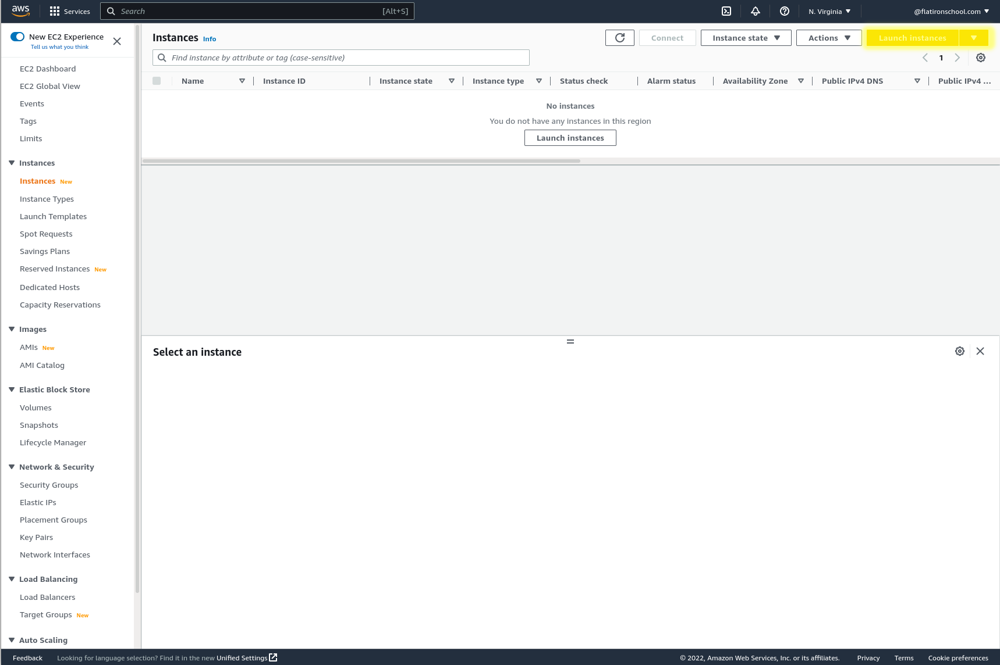


We will name this new Virtual Machine `template-server`:


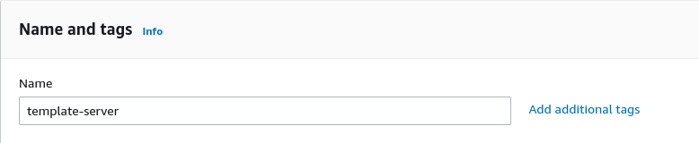


And use an instance type of `t2.micro`:


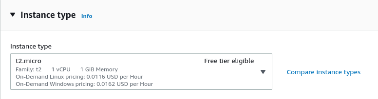


We will create a new ssh keypair named `flatironschool-ec2-key` and attach this
to the VM:


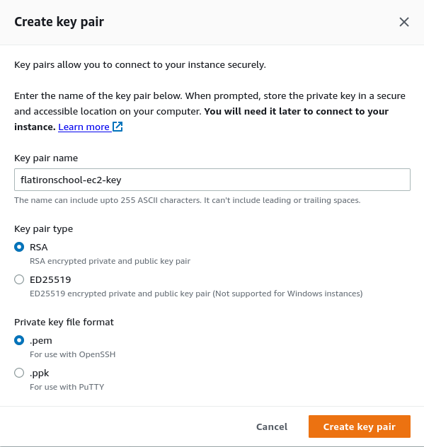


The remaining default parameters can be used to launch this VM.

Once it is in the `Running` state, go ahead and find the Public IPv4 address
that has been configured for it:


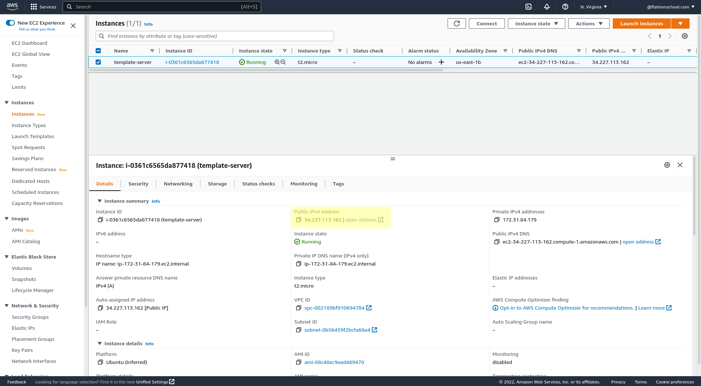


Let us now connect directly to this running VM. We will be using the previous
ssh key we downloaded, and an ssh client of choice:


``` text
chmod 600 flatironschool-ec2-key.pem 
ssh -i flatironschool-ec2-key.pem ubuntu@34.227.113.162 #<-- Replace with your correct Public IP address
```
``` shell
The authenticity of host '34.227.113.162 (34.227.113.162)' can't be established.
ED25519 key fingerprint is SHA256:UW6niJDDPyzJnahOdfLNuH4CrwQ9vk29kjYW4xXO/Ow.
This key is not known by any other names
Are you sure you want to continue connecting (yes/no/[fingerprint])? yes
Warning: Permanently added '34.227.113.162' (ED25519) to the list of known hosts.
Welcome to Ubuntu 22.04.1 LTS (GNU/Linux 5.15.0-1019-aws x86_64)

 * Documentation:  https://help.ubuntu.com
 * Management:     https://landscape.canonical.com
 * Support:        https://ubuntu.com/advantage

  System information as of Mon Nov 14 17:26:13 UTC 2022

  System load:  0.0859375         Processes:             104
  Usage of /:   19.5% of 7.57GB   Users logged in:       0
  Memory usage: 20%               IPv4 address for eth0: 172.31.84.179
  Swap usage:   0%

0 updates can be applied immediately.


The list of available updates is more than a week old.
To check for new updates run: sudo apt update


The programs included with the Ubuntu system are free software;
the exact distribution terms for each program are described in the
individual files in /usr/share/doc/*/copyright.

Ubuntu comes with ABSOLUTELY NO WARRANTY, to the extent permitted by
applicable law.

To run a command as administrator (user "root"), use "sudo <command>".
See "man sudo_root" for details.

ubuntu@ip-172-31-84-179:~$ 
```


## Creating EC2 AMI


Now that we have an accessible Virtual Machine running, we can configure the
system with some default tools for use as a Virtual Machine template, or
Amazon Machine Image(AMI).

We will be keeping this simple for now, and just installing the Docker tools.


Let us confirm that Docker isn't installed by default on this Ubuntu image:

``` text
ubuntu@ip-172-31-84-179:~$ docker ps
```
``` shell
Command 'docker' not found, but can be installed with:
sudo apt install docker.io      # version 20.10.12-0ubuntu4, or
sudo apt install podman-docker  # version 3.4.4+ds1-1ubuntu1
```

And go through the Docker Install guide to get the Docker tools installed, and
the first part of the Docker Post-Install guide to get the necessary groups and
permissions created:

- [Docker Ubuntu Install](https://docs.docker.com/engine/install/ubuntu/)
- [Docker Ubuntu Post-Install](https://docs.docker.com/engine/install/linux-postinstall/)


Once Docker is installed and configured correctly, the following command should
run without permission issues:


``` text
ubuntu@ip-172-31-84-179:~$ docker run hello-world
```
``` shell
Unable to find image 'hello-world:latest' locally
latest: Pulling from library/hello-world
2db29710123e: Pull complete 
Digest: sha256:faa03e786c97f07ef34423fccceeec2398ec8a5759259f94d99078f264e9d7af
Status: Downloaded newer image for hello-world:latest

Hello from Docker!
This message shows that your installation appears to be working correctly.

To generate this message, Docker took the following steps:
 1. The Docker client contacted the Docker daemon.
 2. The Docker daemon pulled the "hello-world" image from the Docker Hub.
    (amd64)
 3. The Docker daemon created a new container from that image which runs the
    executable that produces the output you are currently reading.
 4. The Docker daemon streamed that output to the Docker client, which sent it
    to your terminal.

To try something more ambitious, you can run an Ubuntu container with:
 $ docker run -it ubuntu bash

Share images, automate workflows, and more with a free Docker ID:
 https://hub.docker.com/

For more examples and ideas, visit:
 https://docs.docker.com/get-started/
```


With Docker now installed, we can now shutdown this server:


``` text
ubuntu@ip-172-31-84-179:~$ sudo shutdown -h now
```


And create an Image from the instance. We'll be naming it `docker-ami`:


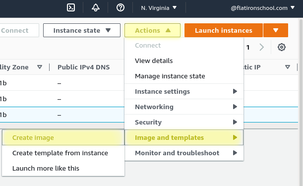

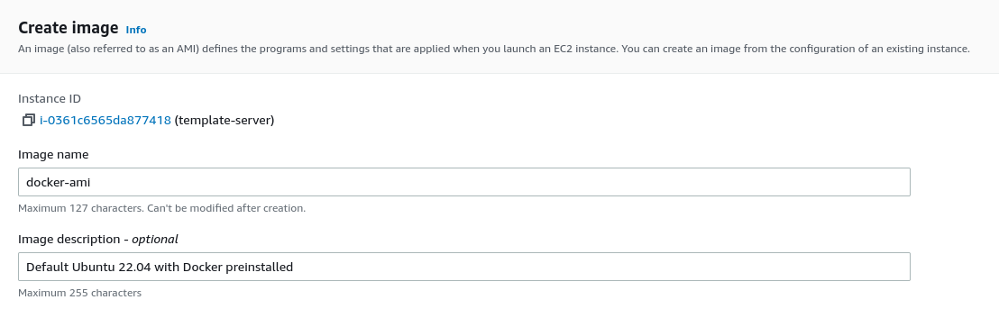


## Launching and Customizing Application Server


Now that we have a custom image created, we can spawn new VM Instances using it
as a base template. We are using just a simple Docker installation for
demonstration purposes here, but Virtual Machine images can be as complicated as
needed for any given application environment.

Note however, as VM images become more complex, you will want to follow
practices introduced in the Advanced Lab portion to keep this complexity
reproducible and well managed.


Let us start with launching a new EC2 instance named `application-server-1`,
using our new image as the backing AMI:


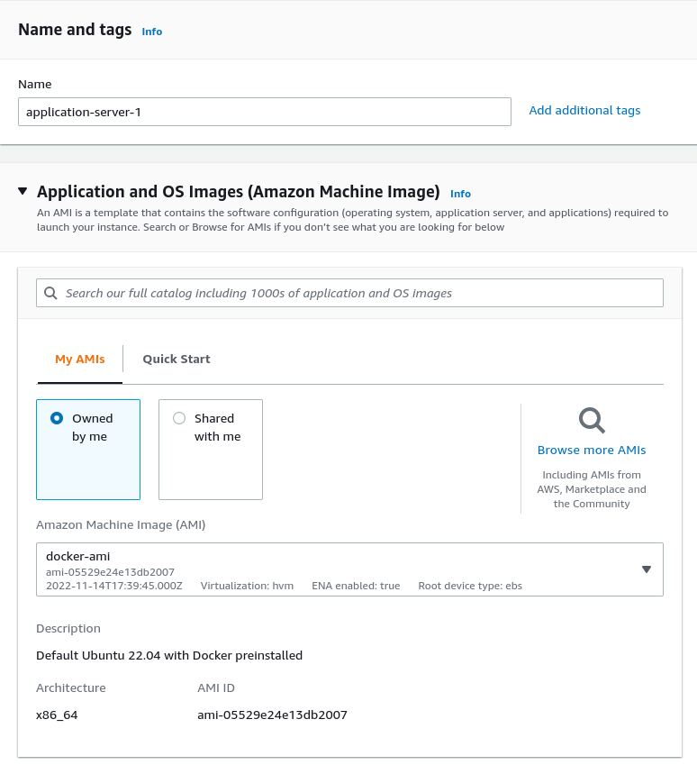


This time around, we will implement some changes to the security rules to both
restrict SSH traffic, and open up HTTP/HTTPS traffic:


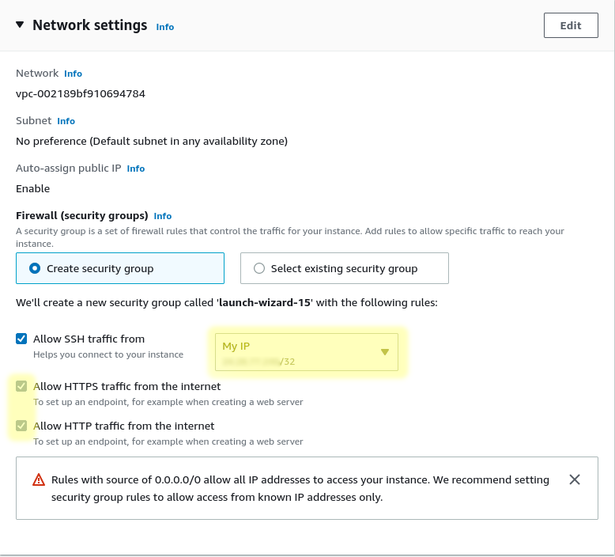

> Note: Adding this `My IP` rule can be flaky from connections with Dynamic IP
> allocation or overly restrictive/overloaded NATed networks. Keep in mind these
> security rules may need to be updated if anything changes.


For the remaining configuration, use all the same options as with the previous
instance.

Once this new EC2 instance is running, ssh to the machine: 


``` text
ssh -i flatironschool-ec2-key.pem ubuntu@54.91.109.105 
```
``` shell
The authenticity of host '54.91.109.105 (54.91.109.105)' can't be established.
ED25519 key fingerprint is SHA256:N1zTL6WAy3z5Dg8YWBLl/mQEZDwdYP0/+H3J4evUcf4.
This key is not known by any other names
Are you sure you want to continue connecting (yes/no/[fingerprint])? yes
Warning: Permanently added '54.91.109.105' (ED25519) to the list of known hosts.
Welcome to Ubuntu 22.04.1 LTS (GNU/Linux 5.15.0-1019-aws x86_64)

 * Documentation:  https://help.ubuntu.com
 * Management:     https://landscape.canonical.com
 * Support:        https://ubuntu.com/advantage

  System information as of Mon Nov 14 17:47:59 UTC 2022

  System load:  0.4375            Processes:                105
  Usage of /:   28.7% of 7.57GB   Users logged in:          0
  Memory usage: 24%               IPv4 address for docker0: 172.17.0.1
  Swap usage:   0%                IPv4 address for eth0:    172.31.87.242


83 updates can be applied immediately.
52 of these updates are standard security updates.
To see these additional updates run: apt list --upgradable


Last login: Mon Nov 14 17:26:14 2022 from XX.XX.XX.XX
ubuntu@ip-172-31-87-242:~$
```


And confirm that it has Docker pre-installed and working:


``` text
ubuntu@ip-172-31-87-242:~$ docker run hello-world
```
``` shell
Hello from Docker!
This message shows that your installation appears to be working correctly.

To generate this message, Docker took the following steps:
 1. The Docker client contacted the Docker daemon.
 2. The Docker daemon pulled the "hello-world" image from the Docker Hub.
    (amd64)
 3. The Docker daemon created a new container from that image which runs the
    executable that produces the output you are currently reading.
 4. The Docker daemon streamed that output to the Docker client, which sent it
    to your terminal.

To try something more ambitious, you can run an Ubuntu container with:
 $ docker run -it ubuntu bash

Share images, automate workflows, and more with a free Docker ID:
 https://hub.docker.com/

For more examples and ideas, visit:
 https://docs.docker.com/get-started/
```


Once we've confirmed it to be working properly, we can launch a simple web
application. For this lab, we will be using a container running
[Redis Commander](https://joeferner.github.io/redis-commander/) for
demonstration. There is additional information on the
[Docker Hub](https://hub.docker.com/r/rediscommander/redis-commander) page on
how to configure it, but the following should be sufficient here:


``` text
ubuntu@ip-172-31-87-242:~$ docker run --rm --name redis-commander -d -p 80:8081 rediscommander/redis-commander:latest
```
``` shell
Unable to find image 'rediscommander/redis-commander:latest' locally
latest: Pulling from rediscommander/redis-commander
339de151aab4: Pull complete 
f732fa32fc61: Pull complete 
ef60bb667d5a: Pull complete 
4f50fa5032a4: Pull complete 
Digest: sha256:19cd0c49f418779fa2822a0496c5e6516d0c792effc39ed20089e6268477e40a
Status: Downloaded newer image for rediscommander/redis-commander:latest
7a7cea088a6eb859c02931b687ce28126c9b1ea33087674bc57399f199937fe8
```


Once the application is running, we can navigate to `http://<Public IP Address>`
in any browser to access this now running application:


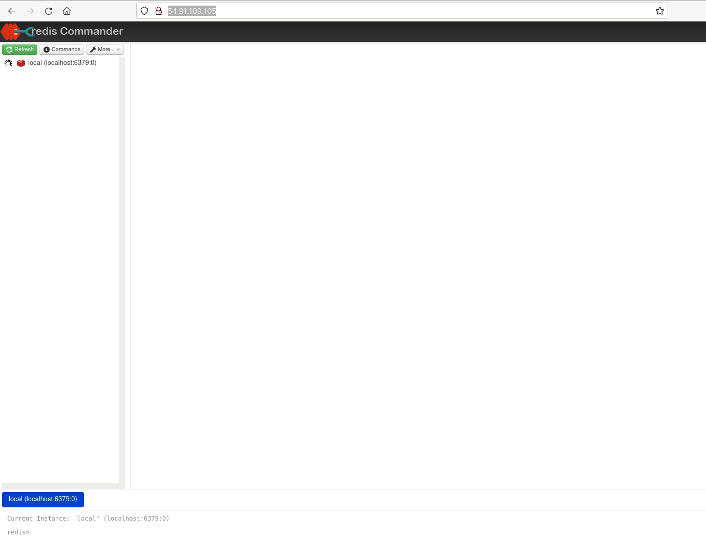


## Launching and Customizing Database Server


Now that we have the simple web application running, let us stand up the backend
Database server and connect the application to it.

Go through the same process again to create another EC2 Instance named
`database-server-1`. Restrict the SSH network access again, but leave the
HTTP/HTTPS access unchecked this time.

Once the VM is running, ssh to this machine:


``` text
ssh -i flatironschool-ec2-key.pem ubuntu@18.234.240.28
```
``` shell
Welcome to Ubuntu 22.04.1 LTS (GNU/Linux 5.15.0-1019-aws x86_64)

 * Documentation:  https://help.ubuntu.com
 * Management:     https://landscape.canonical.com
 * Support:        https://ubuntu.com/advantage

  System information as of Mon Nov 14 21:03:49 UTC 2022

  System load:  0.740234375       Processes:                106
  Usage of /:   28.7% of 7.57GB   Users logged in:          0
  Memory usage: 24%               IPv4 address for docker0: 172.17.0.1
  Swap usage:   0%                IPv4 address for eth0:    172.31.83.95


83 updates can be applied immediately.
52 of these updates are standard security updates.
To see these additional updates run: apt list --upgradable


Last login: Mon Nov 14 17:26:14 2022 from XX.XX.XX.XX
ubuntu@ip-172-31-83-95:~$
```


And start up a [Redis](https://redis.io/) instance:


``` text
ubuntu@ip-172-31-83-95:~$ docker run --rm --name redis -d -p 6379:6379 redis
```
``` shell
Unable to find image 'redis:latest' locally
latest: Pulling from library/redis
e9995326b091: Pull complete 
f2cd78d6f24c: Pull complete 
8f3614d34c89: Pull complete 
697fd51ec515: Pull complete 
a554cf50a327: Pull complete 
66f93c02e79c: Pull complete 
Digest: sha256:aeed51f49a6331df0cb2c1039ae3d1d70d882be3f48bde75cd240452a2348e88
Status: Downloaded newer image for redis:latest
574b73885895178ed3c86cb11b860ab5a10caf78fd2eb5169c39eb2b8cc986de
```


At this point, the Redis server is running, but is inaccessible. If you try to
connect the Web App to this backend Database server as is, the network
connection will fail.

While we had opened up default HTTP/HTTPS ports on our application side, we have
not yet opened up any network ports for our client to communicate with the Redis
Database instance.

We have setup the Application server with HTTP(port 80) and HTTPS(port 443) open
ingress from the entire internet(0.0.0.0/0). While this is a common practice for
Web Applications, it is incredibly risky to allow open ingress to database
systems. A common practice is to restrict network access from only individual
application servers that need access, but for now we will implement a simpler
solution to only allow Private IP resources in our AWS Virtual Private
Cloud(VPC) to have access.


Let us navigate to the VPC that our EC2 instance currently resides in:


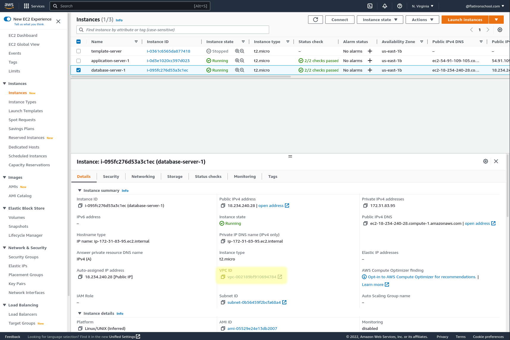

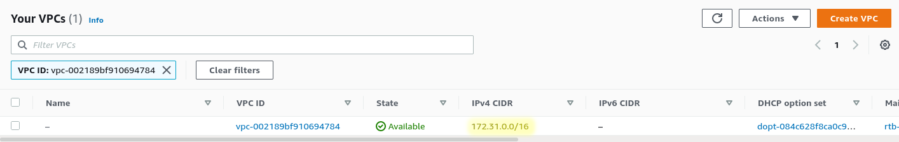


And we can see that this VPC is using a subnet inside a Private IP range
specified by [RFC 1918](https://www.rfc-editor.org/rfc/rfc1918). In this case,
the default VPC should be using `172.31.0.0/16`, so any EC2 instances that are
created will have Private IP addresses that fall within this range.

Let us now navigate to the default security group attached to our Database EC2
Instance:


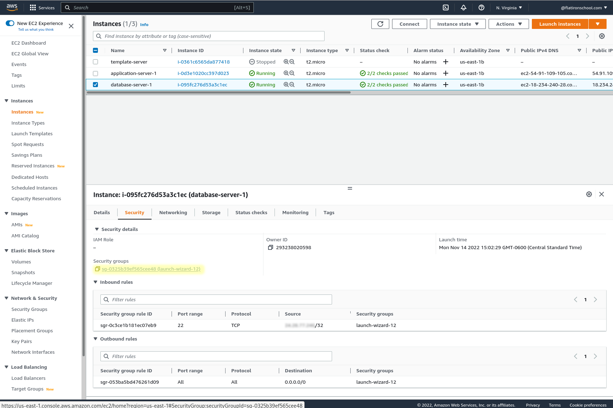


And add an inbound rule allowing restrictive access for our Redis server
application:


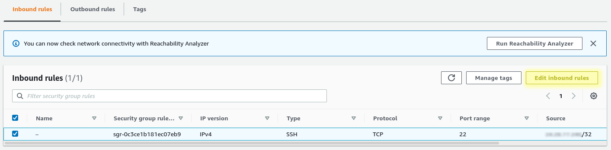

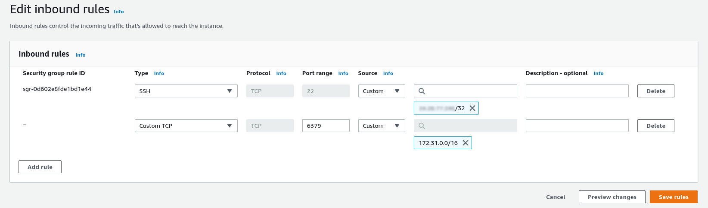


Once this network access is implemented, we can now add the backend Redis
Database to our Web Application:


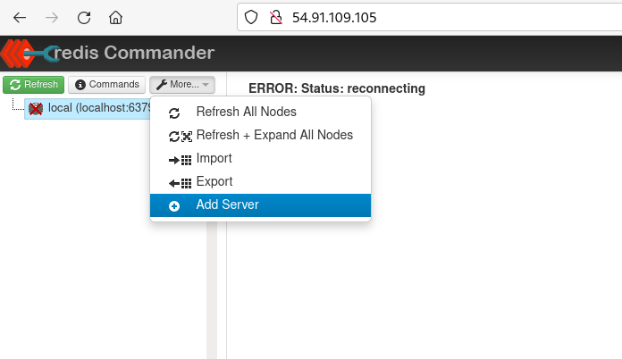

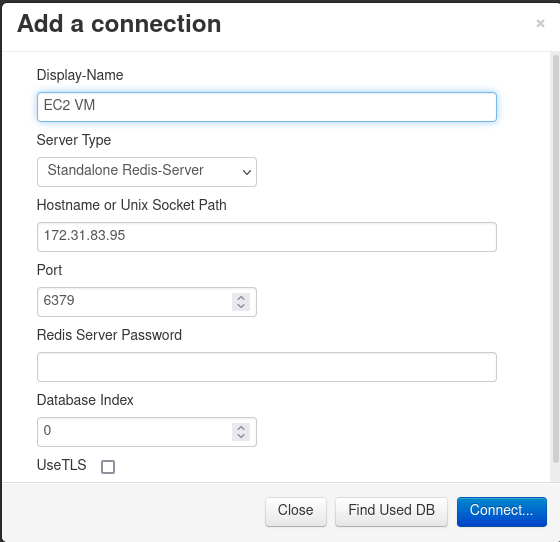


And we should see that the connection now works:


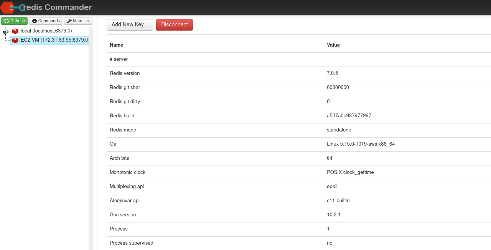


## Security Concerns


If you haven't needed to manage secure environments exposed to the Internet
before, you will have to be ready for a rude awakening when you start
building systems in the Cloud. As Cloud Platforms are intended to provide
Internet facing services, insecure configurations are only a typo away, and the
onerous task of security needs to be a first-class concern.

This could be a complete lab in its own right, so for now let us just take a
look at a quick example.


Let's first start by removing all outbound rules from `database-server-1`: 


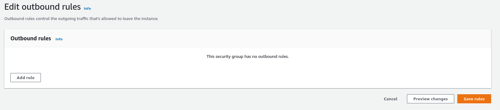


Now, we will go in and modify one inbound rule to allow full Internet access to
our Redis Database:


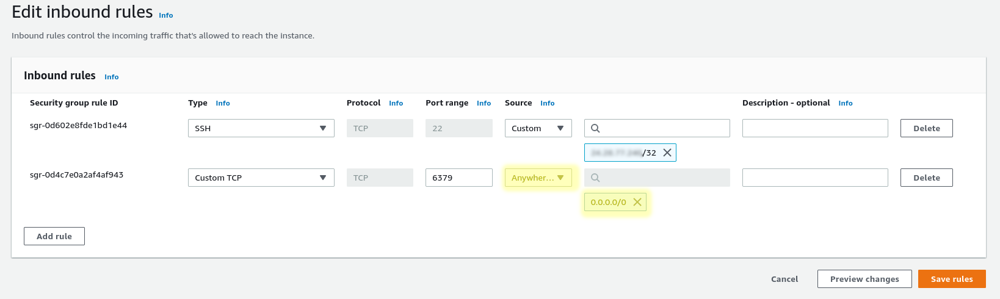


And assuming attacks are still running in the wild(still going as of 11/16/2022),
you should see your Redis instance attacked in 10 minutes or so:


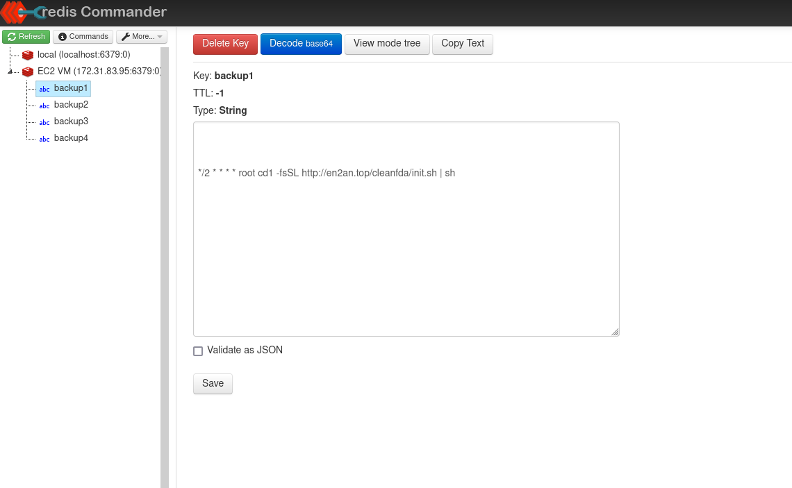


You can read up more on this [Redis Cryptocurrency Mining Worm](https://www.trendmicro.com/en_us/research/20/d/exposed-redis-instances-abused-for-remote-code-execution-cryptocurrency-mining.html)
if you are interested in the specific exploit.


## Advanced Lab

What we have accomplished up to this point has been a manual process for
managing EC2 VM Images. This is a completely valid workflow when learning these
processes, and even for some smaller environments that can be easily managed and
documented. However, once you get into managing larger and more critical
applications and environments, having this infrastructure managed as declarative
configuration files or scripts becomes absolutely critical.

If you still have time at this point, take a look at the getting started guides
for Hashicorp Packer which is a common and industry standard tool for generating
Virtual Machine images, or so called "Golden Images".

- [Install Packer](https://developer.hashicorp.com/packer/tutorials/aws-get-started/get-started-install-cli)
- [Build an Image](https://developer.hashicorp.com/packer/tutorials/aws-get-started/aws-get-started-build-image)
- [Provision](https://developer.hashicorp.com/packer/tutorials/aws-get-started/aws-get-started-provision)

> Note: For setting up the AWS secrets and keys here, you will need to create
> another API key. You can follow the same process that was done for setting up
> the testing keys, but can grant `AdministratorAccess` here instead. These
> permissions are overkill and would not be considered best practices, but
> should be fine here for validating this workflow. You will also need to modify
> the region used in the getting started guides to use `us-east-1`.


## Cleanup


Once done with this lab:

- Terminate all the EC2 instances that were created
- Deregister all AMIs except `docker-ami` 
- Delete all snapshots that you can(you won't be allowed to delete the remaining AMI snapshot)
